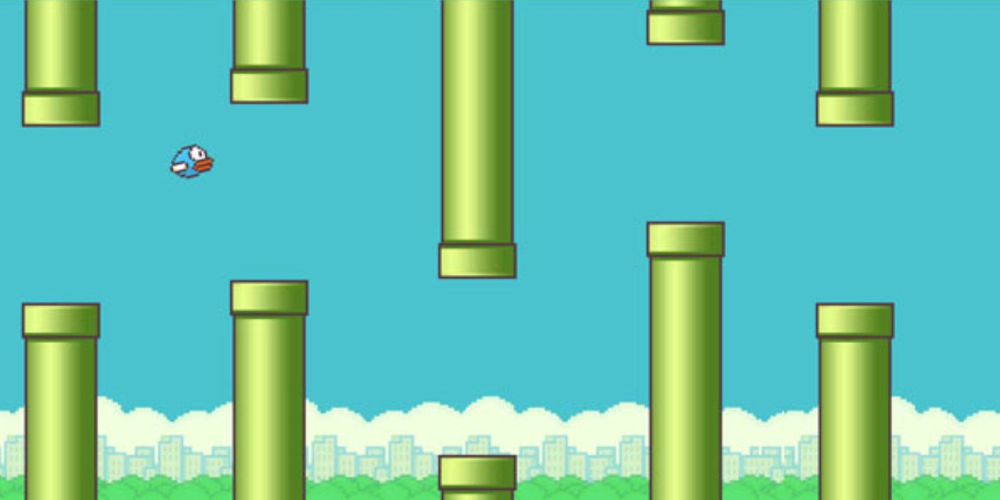

# 🐦 Flappy Bird

<a href="https://flappy-bird-univali.vercel.app/">
  
</a>

## 📖 Sobre o Projeto

Este projeto é uma recriação do icônico Flappy Bird, originalmente desenvolvido por Dong Nguyen em 2013. O jogador controla um pássaro que deve atravessar uma série infinita de canos suspensos no ar, evitando colisões com os obstáculos ou com o chão através de toques na tela ou pressionando a barra de espaço para impulsionar o pássaro para cima enquanto a gravidade o puxa constantemente para baixo. Desenvolvido com Unity Engine e C#, o projeto aplica conceitos de física 2D, detecção de colisões, gerenciamento de estado e interface de usuário, sendo disponibilizado em versão WebGL para execução diretamente no navegador sem necessidade de instalação.

## 🛠️ Tecnologias Utilizadas

- **Engine:** Unity Engine (2021.3 LTS ou superior)
- **Linguagem:** C#
- **Plataforma:** WebGL (jogável no navegador)
- **Hospedagem:** Render

## 🔧 Configuração para Desenvolvimento

1. Clone este repositório
   ```bash
   git clone https://github.com/mapompeo/flappy-bird
   ```

2. Abra o projeto no Unity (versão recomendada: 2021.3 LTS ou superior)

3. Abra a cena principal localizada em `Assets/Scenes/`

4. Pressione Play no Unity Editor para testar

## 📝 Build para WebGL

1. Vá em `File > Build Settings`
2. Selecione a plataforma `WebGL`
3. Clique em `Switch Platform`
4. Clique em `Build` e escolha a pasta de saída
5. Faça upload dos arquivos da pasta de build para seu servidor web

## 🎓 Contexto Acadêmico

**Instituição:** UNIVALI - Itajaí, SC  
**Curso:** Ciência da Computação - 2025  
**Disciplina:** Algoritmos e Programação II  
**Período:** 2025/2

## 📄 Licença

Este projeto está sob a licença MIT - veja o arquivo [LICENSE](LICENSE) para mais detalhes.

## 👨‍💻 Desenvolvedores

Desenvolvido por [José Gabriel](https://github.com/naasdd), [Matheus Pompeo](https://github.com/mapompeo) e [Nathan Reichert](https://github.com/nathanreichert13).

## ⭐ Apoie o Projeto

Dê uma ⭐️ se você gostou deste projeto!

---

**Nota:** Este é um projeto acadêmico criado para fins de estudo.
